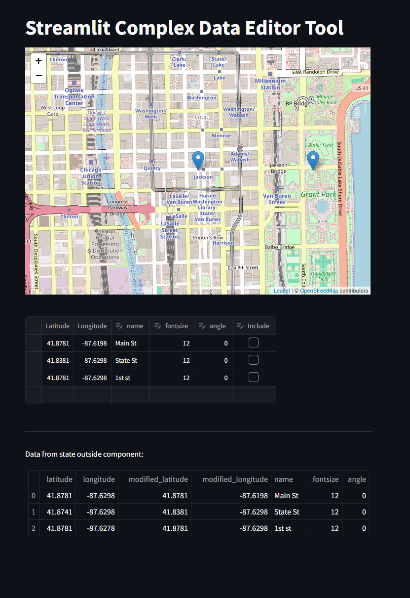
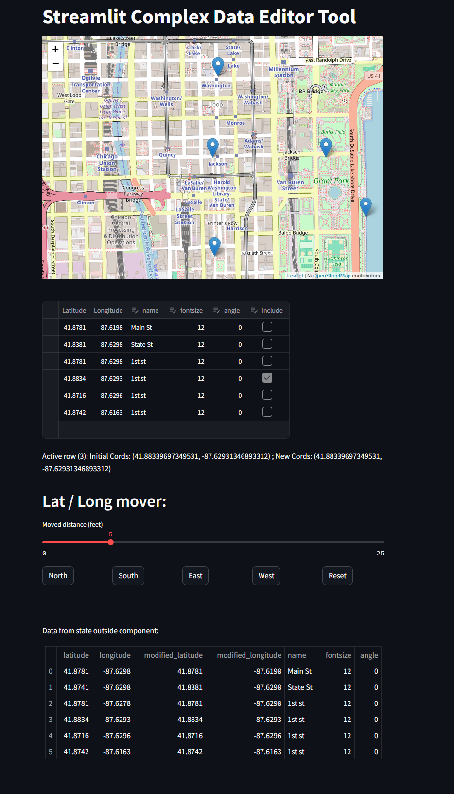

# Streamlit Data Editor Tool

I wanted to experiment with the new data_view feature in streamlit, so I tried to push it past its limits in effort to make a more complex tool for a different project of mine.

Special features:
- Button to enable special editor for one row view checkboxes
- only one row active at a time (auto toggle off last)
- Change latitude and longitudes with a compass button grid
- persist data back somewhere

## Usage

```sh
pip install -r requirements.txt
streamlit run app.py
```

### Base state



### Special editing mode:




## Design Details

### Handling and modifying data

Two types of data points / columns:
- Actual data
- Utility / UI columns irrelevant to fundamental data
    - In this case the "Include" Checkbox column that enables a special editor for that row
    - Only one check box toggled at a time


The real data needs to be persisted somewhere, so its source of truth is in session state.
- Data_editor will load off session state
- Special update functions will ensure changes are mapped to session_state


Design in context of this dataset
- lat/long base
    - Used only for resetting value
- lat/long modified
    - Passed to data_editor
- font size
    - Editable view st.data_view
- rotation
    - TBD but probably same as font size
- name
    - Read only


Tricks:
- Session state is source of truth, and every time it updates the dataframe is recreated
    - This means every time we get a callback from data_view, the `edited_rows` should have 1 value

### Problems
My existing streamlit-folium + Draw plugin seems to have unexpected results with how streamlit cacheing works by default. If use a naive approach, the map gets remade everytime, and just abuses resources and messes up other state.

Instead I need to go abandon using the Draw plugin (which was awkward anyways) then add things to the map using on_click events